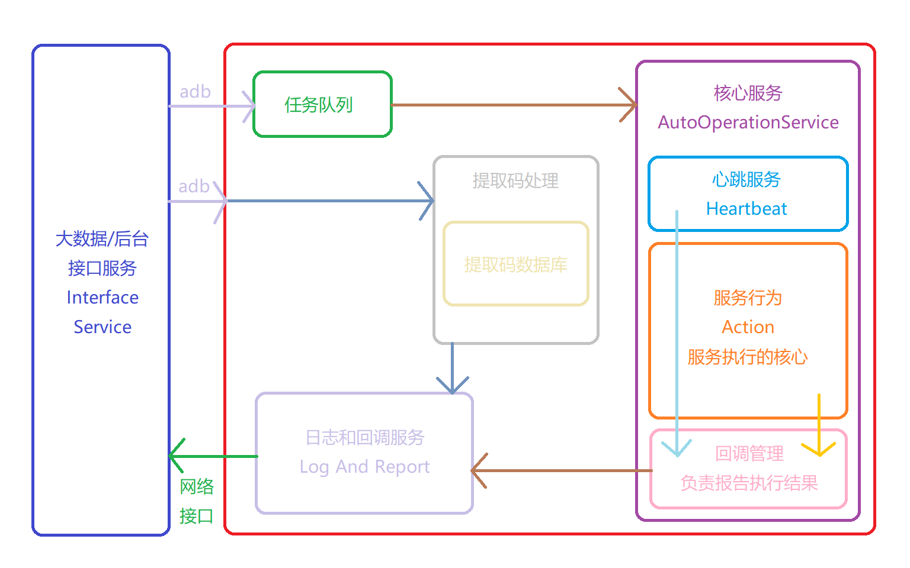
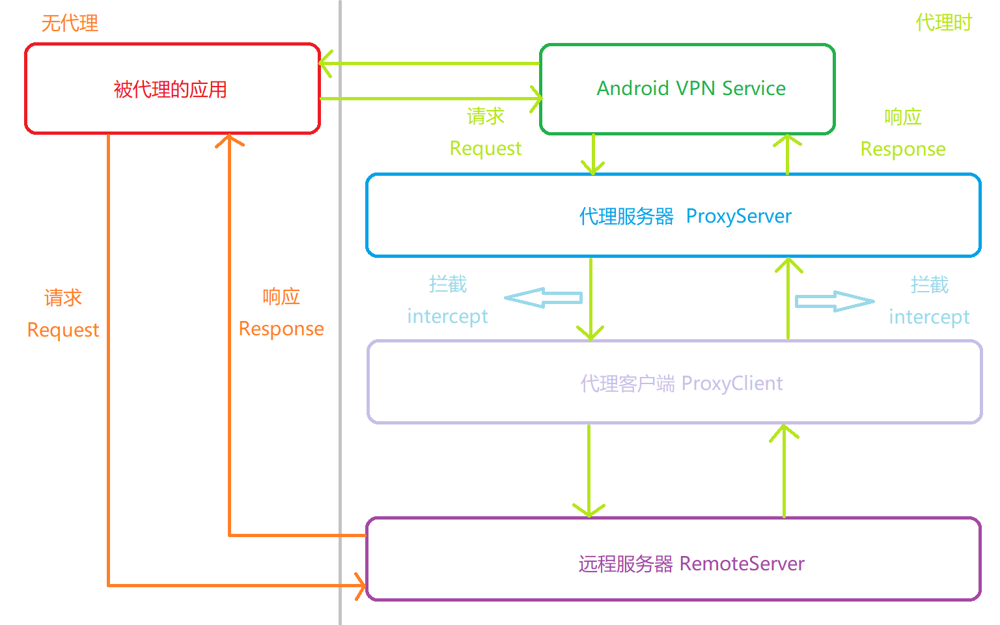

# AAOS

Android Automatic Operation Service

Designed by Kokomi 2022


## AAOS 简单结构图




## WireBare 简单结构图




## AAOS 技术栈

- Kotlin

  - Kotlin 是世界上最好的语言.java

  - [JetBrains Kotlin](https://kotlinlang.org/)
- Retrofit2

  - 网络请求框架

  - [Square Retrofit2](https://square.github.io/retrofit/)
- Room

  - Jetpack 组件，数据库操作框架
  - [Android Developers Jetpack Room](https://developer.android.google.cn/training/data-storage/room?hl=zh-cn)
- AccessibilityService

  - 安卓无障碍服务

  - [Android Developers AccessibilityService](https://developer.android.google.cn/reference/kotlin/android/accessibilityservice/AccessibilityService?hl=en)
- Java nio

  - 抓包功能的代理服务器和代理客户端的实现
- Android VPN Service
  - 安卓 ip 包代理接口
- Shizuku

  - 让你的应用直接使用系统 API
  - [Shizuku](https://shizuku.rikka.app/zh-hans/)
  - [Github Shizuku](https://github.com/RikkaApps/Shizuku)
  - [Github Shizuku-API](https://github.com/RikkaApps/Shizuku-API)


## AAOS 运行环境

- Android SDK >= 24
- 屏幕需要常亮不能熄灭
- 手机上不要存留有任何一张照片


## 受害者名单

|          应用包名          |  应用名  | 版本号 |         备注         |
| :------------------------: | :------: | :----: | :------------------: |
|  com.topviewclub.crawling  |   AAOS   |  你猜  |       能跑就行       |
|       com.tencent.mm       |   微信   | 8.0.18 | 正式版，需要登陆账号 |
|      cn.xuexi.android      | 学习强国 | 2.0.40 |     需要登陆账号     |
| moe.shizuku.privileged.api | Shizuku  | 12.14  |   需要激活 Shizuku   |


## 部署

### 常用指令

- 启动微信

```shell
adb shell am start com.tencent.mm/.ui.LauncherUI
```


- 强制关闭微信

```shell
adb shell am force-stop com.tencent.mm
```


- 启动 AAOS 应用

```shell
adb shell am start com.topviewclub.crawling/.core.ui.CrawlingActivity
```


- 启动 AAOS 服务

```shell
adb shell am broadcast -a com.topviewclub.crawling.broadcast.START_AAOS -p com.topviewclub.crawling
```


- 启动日志打印

```shell
adb logcat * | find "AAOS"
```


- 强制关闭 AAOS 应用和服务

```shell
adb shell am force-stop com.topviewclub.crawling
```


公众号采集过程中的点击、长按、滑动、返回和回桌面均由无障碍服务完成：

- 可访问节点优先使用 `AccessibilityNodeInfo.ACTION_CLICK` / `ACTION_LONG_CLICK`
- 自绘页面使用无障碍服务的 `dispatchGesture()`
- 页面切换只在收到无障碍事件确认后推进

不要使用 `adb shell input tap/swipe/keyevent` 代替采集动作；ADB 仅用于安装、授权
和读取诊断信息。


### 准备工作

- 确保手机 Android SDK >= 24

- 确保手机上没有存留有任何一张照片

- 将手机屏幕设为永不熄灭

- 禁用手机的自动下载 / 更新系统功能

- 锁好 AAOS 的后台

- 如果手机系统有类似“允许应用后台弹出界面”的权限，请授权

- 打开手机的开发者模式，打开 USB 调试，连接主机，输入以下指令确保手机连接成功

  - ```shell
    adb devices
    ```


### 安装

- 安装 AAOS v你猜
- 安装微信 v8.0.18
- 安装学习强国 v2.0.40
- 安装 Shizuku v12.14


### 微信配置

- 登录好任一微信账号，现存的微信账号如下

|     号      |  懂的都懂   | 手机号      |
| :---------: | :---------: | ----------- |
|   qqgzxys   |  xt2316677  |             |
| 15913103435 |  1qaz1QAZ   | 15913103435 |
| 19867619860 |  l12345678  | 19867619860 |
| topviewlala | topview@624 | 18199978724 |

- **强烈建议不要用自己的微信号进行测试，否则后果自负**
- 登陆完成后打开扫一扫，微信会索要相机权限，给它
- 扫一扫界面点一下右下角的相册，微信会索要存储权限，给它


设备编码

| 微信号      | 设备编码         | 对应手机型号 | 对应微信名称 |
| ----------- | ---------------- | ------------ | ------------ |
| topviewlala | M7Z5HABUMJT8BUO7 | 红米note11T  | 拉拉，只只   |
| 15913103435 | 0123456789ABCDEF | 华为         | 只只         |
| qqgzxys     | C6P7HYDY9LYHAQON | 红米note11T  | 艾小新，为为 |


### 学习强国配置

- 登录好任意学习强国号，现存的学习强国号如下

|   号   | 懂的都懂 |
| :----: | :------: |
| 没有啦 |  别看啦  |

- **强烈建议不要用自己的学习强国账号进行测试，否则后果自负**


### Shizuku 配置

#### Shizuku 概述

- 相信师弟们很少有认识 Shizuku 的吧，这里附上 Shizuku 的一些介绍，感兴趣可以看看
  - [Shizuku 官网](https://shizuku.rikka.app/)
- 项目内用 Shizuku 可以使 AAOS 进行一些超越 AAOS 原本仅作为一个安卓应用权限的操作


#### 配置

- 打开 Shizuku ，根据其介绍激活 Shizuku 即可


### AAOS 配置

- 先别打开 AAOS ，先执行以下命令

  - ```shell
    adb shell pm grant com.topviewclub.crawling android.permission.WRITE_SECURE_SETTINGS
    ```

  - 这里是取得修改安全设置的系统最高权限，因为这个权限很特殊，因此只能通过 ADB 授权

  - 取得这个权限可以让 AAOS 自主操控无障碍服务的执行，而不需要人工介入

- 打开已经激活的 Shizuku

- 打开 AAOS

  - 启动 AAOS 服务

  ```shell
  adb shell am broadcast -a com.topviewclub.crawling.broadcast.START_AAOS -p com.topviewclub.crawling
  ```

- 分别点击上方两个按钮，分别授权

  - 第一个按钮是取得微信缓存视频文件夹的读写权限
  - 第二个按钮是连接 Shizuku 服务**（对 AAOS 进行超限！）**


## 龟速入门

- AAOS
  - 主机通过 shell 输入 adb 命令传入广播来控制 AAOS 执行任务
  - AAOS 通过访问主机的接口将任务执行结果返回给主机

- 主机控制 AAOS 的类型大致分为三种

  - 全局参数
  - 单向接口（无返回值）
  - 双向接口（有返回值）
  - 任务参数配置

- AAOS 通过访问主机的接口将任务执行结果返回给主机

  - 特殊指令

  - 执行结果
  - 执行结果取回
  - 心跳和日志


## 通信（方向：主机   > > >  AAOS）

### 全局参数

#### IP

- 设置主机接口的 IP 地址，以让 AAOS 与 主机正常通信
- 命令如下

```shell
adb shell am broadcast -a com.topviewclub.crawling.broadcast.IP -p com.topviewclub.crawling -e ip <ip>
```

- \<ip\> 代表主机接口的 IP 地址，例如 IP 地址为 192.168.0.1


### 单向接口（无返回值）

- 这一板块以前有用，现在没用了，全部改成 AAOS 自动化处理了，不再需要外部命令干预
- 实际上 AAOS 源码依然保留着这些接口
  - UpdateImage
    - 这个接口原本用于更新二维码图片，现在自动更新
  - Reset
    - 这个接口原本用于重置任务参数
  - ClearAll
    - 这个接口原本用于清除缓存，现在自动清除


### 双向接口（有返回值）

- 目前只有单个视频提取需要双向接口


#### RequireVideo

- 执行此命令，将返回给定提取码的视频 URL 链接
- 命令如下

```
adb shell am broadcast -a com.topviewclub.crawling.broadcast.REQUIRE_VIDEO -p com.topviewclub.crawling -e code <request_code>
```

- \<request_code\> 表示提取码

- 返回值

  - 将在主机的 /acvideo 接口返回结果，message 中即为请求结果

  - 即以如下格式访问主机接口（假设 IP 为 192.168.0.1）

    - ```
      http://192.168.0.1/acvideo?message=<result>
      ```

    - \<result\> 为返回的结果


### 任务参数配置

|    名称    |    解释    |
| :--------: | :--------: |
|    type    |  服务类型  |
|    tag     | 服务的标记 |
| start_date |  开始日期  |
|  end_date  |  结束日期  |
|   target   |  目标账号  |


### 参数支持情况

|       功能       |        type         | tag  | start_date | end_date | target |
| :--------------: | :-----------------: | :--: | :--------: | :------: | :----: |
|  微信视频号频道  |        video        | 支持 |    支持    |  不支持  |  支持  |
|  微信公众号频道  |      official       | 支持 |    支持    |   支持   |  支持  |
|  微信二维码检测  | wechat_qrcode_check | 支持 |     ❌      |    ❌     |  支持  |
| 学习强国文章频道 |       xue_xi        | 支持 |    支持    |   支持   |  支持  |

- "支持" 表示支持，"不支持" 代表不支持，"❌" 代表没必要传，传了也不会生效

- 支持的参数必须传，不支持的参数传了也没用


### 参数详解

#### type

- 参数 type 代表本次任务的类型，如果传入不受支持的类型，将会回报错误

- 此命令应该在其它参数配置完成后再进行配置，也就是说，执行完此命令后，任务将开始被调度

- 命令如下

```shell
adb shell am broadcast -a com.topviewclub.crawling.broadcast.START_CRAWLING -p com.topviewclub.crawling -e type <type>
```

- \<type\> 代表本次任务的类型，详情见见参数支持情况表


#### tag

- 参数 tag 为任务的标记，因为是并发执行，因此在返回结果时需要此参数来表示返回的结果是哪一个任务
- 应保证 tag 为唯一的任务标识符，否则将会导致混淆
- 命令如下

```shell
adb shell am broadcast -a com.topviewclub.crawling.broadcast.TASK_TAG -p com.topviewclub.crawling -e tag <tag>
```

- \<tag\> 代表本次任务的标记


#### start_date

- 参数 start_date 是给任务设置的起始日期，任务将会从此日期开始执行
- 实际上并不能完全保证返回的结果为此起始日期之后，但请放心，返回的结果要么符合要求，要么有赘余（日期小于起始日期也被提取出来），保证不会少
- 命令如下

```shell
adb shell am broadcast -a com.topviewclub.crawling.broadcast.START_DATE -p com.topviewclub.crawling -e date <start_date>
```

- \<start_date\> 代表起始日期，格式为 yyyy-MM-dd ，例如 1314 年 5 月 20 日为 1314-05-20


#### end_date

- 参数 end_date 是给任务设置的结束日期，任务将会在此日期结束
- 实际上并不能完全保证返回的结果为此结束日期之前，但请放心，返回的结果要么符合要求，要么有赘余（日期大于结束日期也被提取出来），保证不会少
- 命令如下

```shell
adb shell am broadcast -a com.topviewclub.crawling.broadcast.END_DATE -p com.topviewclub.crawling -e date <end_date>
```

- \<end_date\> 代表结束日期，格式为 yyyy-MM-dd ，例如 1314 年 5 月 20 日为 1314-05-20


#### target

- 参数 target 是给任务设置的目标，一般是目标账号名
- 在微信频道（包括视频号频道和公众号频道）中，若给定的二维码扫描结果与给定目标账号名不一致，将会报错
- 命令如下

```shell
adb shell am broadcast -a com.topviewclub.crawling.broadcast.TARGET -p com.topviewclub.crawling -e target <target>
```

- \<target\> 为目标


## 通信（方向：AAOS  > > >  主机）

### 特殊指令

- 特殊指令并不是任务的执行结果，而是任务执行过程中需要主机执行的指令


#### Please Push Picture

- 接收到此指令时，表示主机需要将对应任务的（二维码）图片放置到指定存储位置

- 发送指令的格式为（假设主机的 IP 地址为 192.168.0.1）

```
http://192.168.0.1/error?message=[TaskDispatcher] PPP&tag=<tag>
```

- \<tag\> 表示需要二维码图片的任务的 tag
- 收到此指令后，执行以下三条指令（假设主机对应图片路径为 \<image_path\>）

```shell
adb shell rm -r /sdcard/Android/media/com.topviewclub.crawling/com.topviewclub.crawling/QRCode

adb shell mkdir -p /sdcard/Android/media/com.topviewclub.crawling/com.topviewclub.crawling/QRCode

adb push <image_path> /sdcard/Android/media/com.topviewclub.crawling/com.topviewclub.crawling/QRCode
```

- 注意：图片路径 \<image_path\> 最好仅包括英文和数字，否则可能执行失败


#### Restart Mirco Message

- 接收到此指令时，表示主机需要控制手机重启微信

- 发送指令的格式为（假设主机的 IP 地址为 192.168.0.1）

```
http://192.168.0.1/error?message=[$prefix] RMM&tag=<tag>
```

- $prefix 表示前缀，是任务的类型，具体含义见任务类型前缀说明
- \<tag\> 表示任务的 tag ，主机不必理会
- 收到此指令后，执行以下两条指令，重启微信

```shell
adb shell am force-stop com.tencent.mm

adb shell am start com.tencent.mm/.ui.LauncherUI
```


#### Restart Xue Xi

- 接收到此指令时，表示主机需要控制手机强制关闭学习强国

- 发送指令的格式为（假设主机的 IP 地址为 192.168.0.1）

```
http://192.168.0.1/error?message=[$prefix] RXX&tag=<tag>
```

- $prefix 表示前缀，是任务的类型，具体含义见任务类型前缀说明
- \<tag\> 表示任务的 tag ，主机不必理会
- 收到此指令后，执行以下一条指令，强制关闭学习强国

```shell
adb shell am force-stop cn.xuexi.android
```


### 执行结果

- 执行结果多而杂，这里将全部执行结果罗列出来

| 状态码 |    结果    |          解释          |                 处理方式                 |
| :----: | :--------: | :--------------------: | :--------------------------------------: |
|  200   | TC Success |      任务执行成功      |                    ❌                     |
|  401   | PBE Error  |      处理广播失败      |           检查命令是否存在问题           |
|  402   | UPE Error  | 更新（二维码）图片失败 |        检查（二维码）图片是否合法        |
|  401   | TIN Error  | 未设置任务 target 错误 |       检查是否为任务设置了 target        |
|  401   | SNR Error  |     服务无响应错误     |                 重试任务                 |
|  402   | QCS Error  |   二维码扫描结果错误   | 检查（二维码）图片与给定 target 是否对应 |
|  401   | NET Error  |        网络错误        |            检查网络或重试任务            |
|  401   | UCT Error  |   预料之外的任务类型   |                 重试任务                 |
|  401   | SDU Error  |    任务服务异常退出    |                 重试任务                 |
|  401   | UNK Error  |        未知错误        |                 重试任务                 |

- 返回格式为（假设主机的 IP 地址为 192.168.0.1）

```
http://192.168.0.1/error?message=[$prefix] <result>&tag=<tag>
```

- $prefix 表示前缀，是任务的类型，具体含义见任务类型前缀说明
- \<result\> 即上表中的第一列中的任一个
- \<tag\> 表示本次执行结果所对应任务的 tag


### 任务类型前缀说明

|            前缀             |          说明          |
| :-------------------------: | :--------------------: |
|  AutoChatOperationService   |    微信单个视频服务    |
| CheckQRCodeOperationService | 微信二维码图片检测服务 |
|    VideoOperationService    |   微信视频号频道服务   |
|  OfficialOperationService   |   微信公众号频道服务   |
|    XueXiOperationService    |  学习强国文章频道服务  |


### 执行结果取回

在收到 TC Success 的执行结果回复时，代表任务执行成功，任务的结果已经成功写入到外存中，此时主机可以执行命令来取回执行结果


#### 微信视频号频道

根据任务的 tag ，执行以下命令可以提取指定微信视频号频道任务的执行结果

（\<tag\> 代表对应任务的 tag）

（\<txt_path\> 代表取回执行结果 txt 文件的目标路径）

```shell
adb pull sdcard/Android/media/com.topviewclub.crawling/com.topviewclub.crawling/video_<tag>.txt <txt_path>
```


#### 微信公众号频道

根据任务的 tag ，执行以下命令可以提取指定微信公众号频道任务的执行结果

（\<tag\> 代表对应任务的 tag）

（\<txt_path\> 代表取回执行结果 txt 文件的目标路径）

```shell
adb pull sdcard/Android/media/com.topviewclub.crawling/com.topviewclub.crawling/official_<tag>.txt <txt_path>
```


#### 学习强国文章频道

根据任务的 tag ，执行以下命令可以提取指定学习强国文章频道任务的执行结果

（\<tag\> 代表对应任务的 tag）

（\<txt_path\> 代表取回执行结果 txt 文件的目标路径）

```shell
adb pull sdcard/Android/media/com.topviewclub.crawling/com.topviewclub.crawling/xuexi_<tag>.txt <txt_path>
```


### 心跳和日志

#### 心跳

- 为了确保 AAOS 服务正常运行，没有因为一些意料之外的原因退出或崩溃，因此增加心跳机制
- 当 AAOS 存活时，每隔 30 秒就会向主机的 /heartbeat 接口请求一次，主机可以以此来判断 AAOS 是否正常运行

- 心跳接口的请求格式为，以 GET 方法访问此接口（假设主机的 IP 地址为 192.168.0.1）

```
http://192.168.0.1/heartbeat
```


- 若发现 AAOS 已经死亡，那么可以执行以下指令重启 AAOS ，但此前在任务队列中的所有任务将被清空

```shell
adb shell am force-stop com.topviewclub.crawling

adb shell am start com.topviewclub.crawling/.core.ui.CrawlingActivity

adb shell am broadcast -a com.topviewclub.crawling.broadcast.START_AAOS -p com.topviewclub.crawling
```


#### 日志

日志系统已改进，不再发送日志到主机端，只需要在命令行中输入以下指令即可开启日志打印

```shell
adb logcat * | find "AAOS"
```
